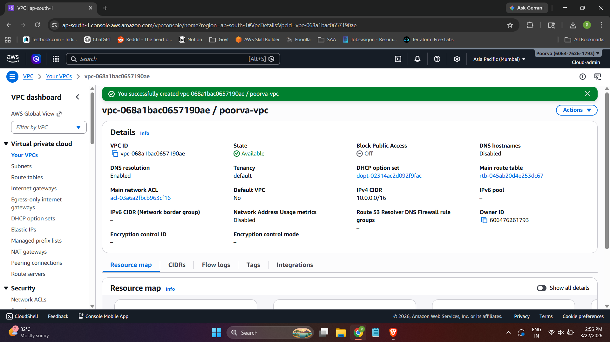
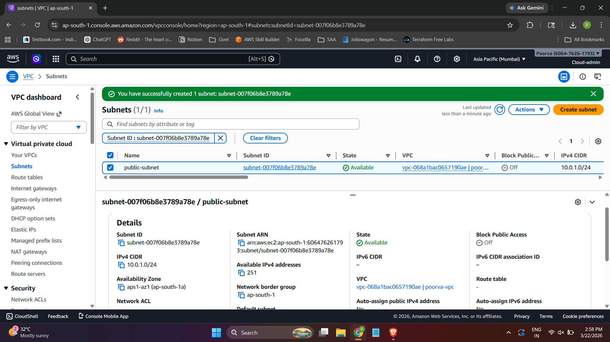
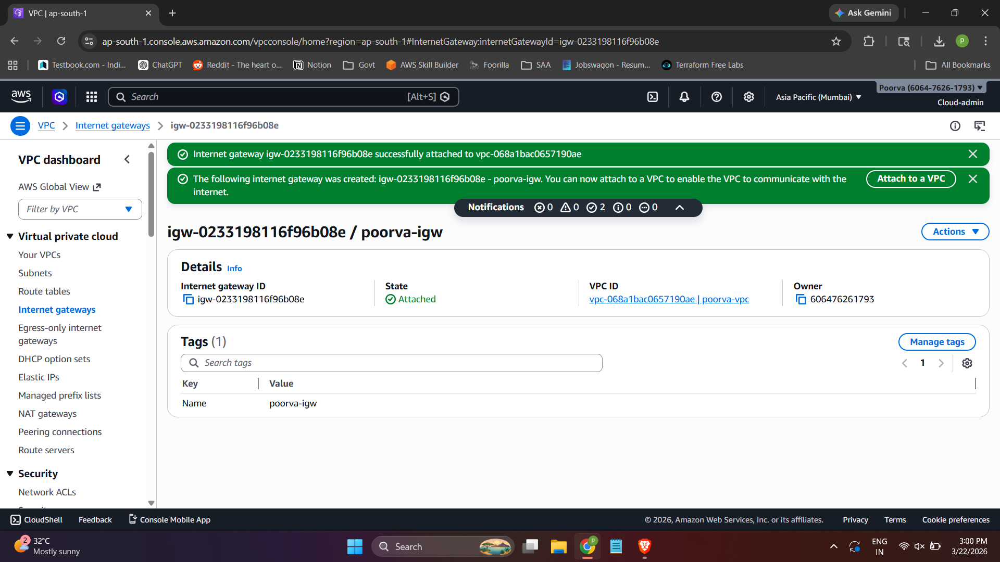
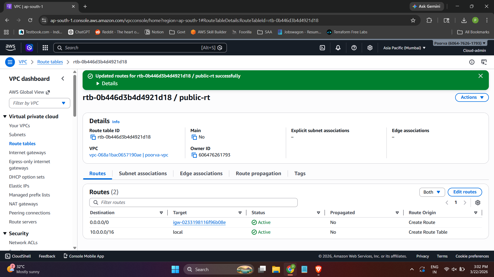
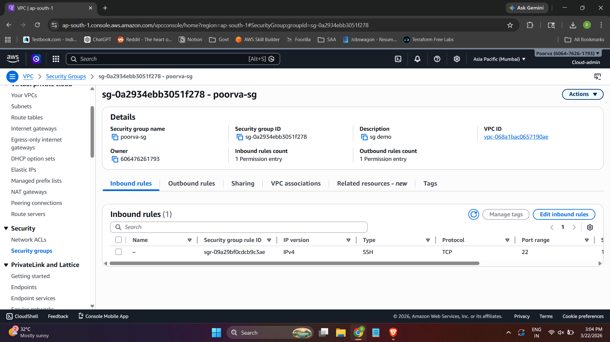
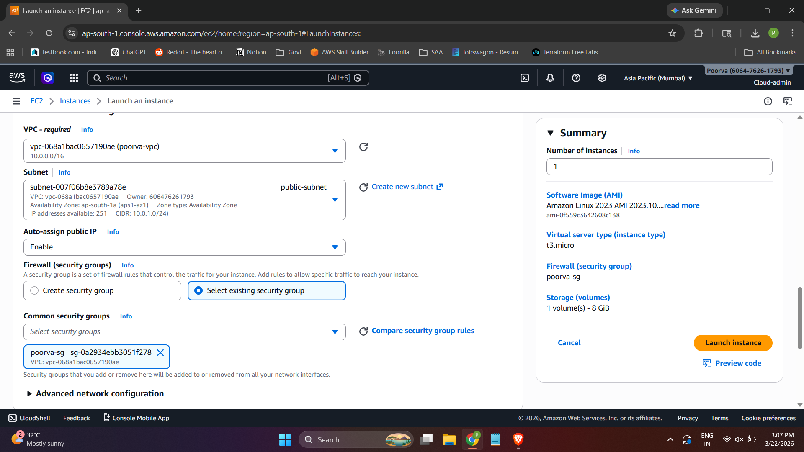
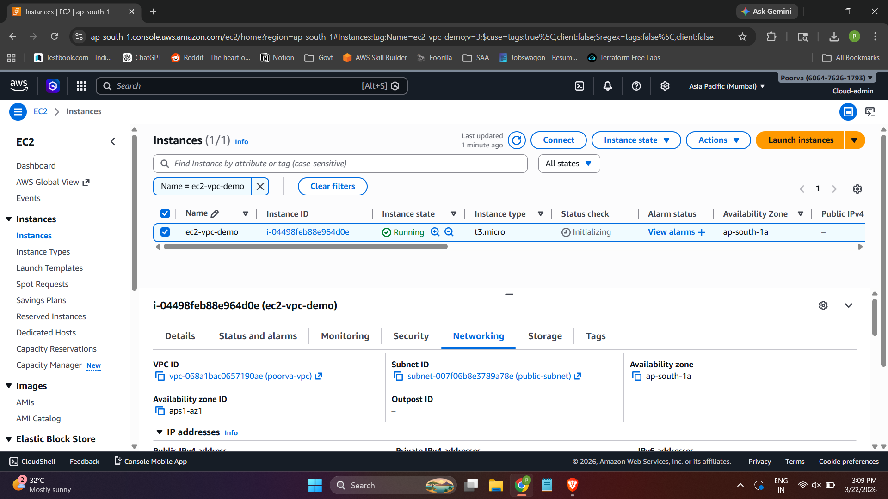
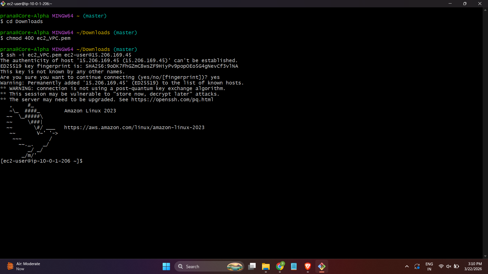
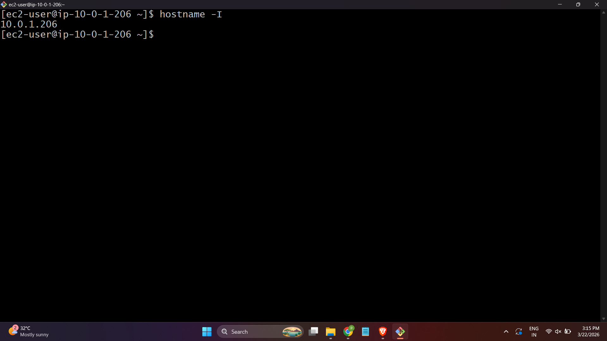

# 🌐 AWS VPC + EC2 Hands-on Project

## 📌 Overview

This project demonstrates the creation of a custom Virtual Private Cloud (VPC) from scratch and launching an EC2 instance within it. It includes configuring networking components such as subnets, route tables, an internet gateway, and security groups to enable secure and controlled internet access.

---

## 🧰 Services Used

* Amazon VPC (Virtual Private Cloud)
* Amazon EC2
* Internet Gateway
* Route Tables
* Security Groups

---

## 🎯 Objectives

* Create a custom VPC with defined CIDR block
* Configure a public subnet
* Enable internet access using Internet Gateway and Route Table
* Launch an EC2 instance inside the custom VPC
* Connect to EC2 via SSH and verify networking setup

---

## 🏗️ Architecture

Custom VPC → Public Subnet → Route Table → Internet Gateway → EC2 Instance

---

## ⚙️ Step-by-Step Implementation

### 1️⃣ Create VPC

* Created a custom VPC with CIDR block: `10.0.0.0/16`
* Named: `poorva-vpc`

---

### 2️⃣ Create Public Subnet

* Subnet CIDR: `10.0.1.0/24`
* Associated with `poorva-vpc`

---

### 3️⃣ Create and Attach Internet Gateway

* Created Internet Gateway: `poorva-igw`
* Attached it to `poorva-vpc`

---

### 4️⃣ Configure Route Table

* Created route table: `public-rt`
* Added route:

  * Destination: `0.0.0.0/0`
  * Target: Internet Gateway
* Associated route table with public subnet

---

### 5️⃣ Configure Security Group

* Created security group: `poorva-sg`
* Allowed inbound traffic:

  * SSH (Port 22) → My IP

---

### 6️⃣ Launch EC2 Instance

* Instance Name: `ec2-vpc-demo`
* Network: `poorva-vpc`
* Subnet: Public Subnet
* Auto-assign Public IP: Enabled
* Security Group: `poorva-sg`

---

### 7️⃣ Connect to EC2

```bash
ssh -i ec2_VPC.pem ec2-user@my-public-ip
```

---

### 8️⃣ Verify VPC Configuration

#### Check Private IP:

```bash
hostname -I
```

* Output confirms subnet range (`10.0.1.206`)

---

## 📸 Screenshots


### VPC creation

### Subnet creation

### Internet Gateway attachment

### Route table configuration

### Security group rules

### EC2 launch configuration

### EC2 running state

### SSH connection

### EC2 hostname verification


---

## 📚 Key Learnings

* Built a custom VPC from scratch
* Understood CIDR block allocation and subnetting
* Configured internet access using Internet Gateway and Route Tables
* Learned how security groups control inbound traffic
* Verified networking setup through SSH and connectivity tests

---

## 🔐 Best Practices Followed

* Used custom VPC instead of default VPC
* Restricted SSH access to specific IP
* Properly configured routing for internet access
* Maintained logical naming conventions

---

## 🧑‍💻 Author

Gajavelli Pranathi Poorva

---

## ⭐ Conclusion

This project demonstrates practical understanding of AWS networking by building a fully functional custom VPC and deploying an EC2 instance with internet connectivity. It forms a strong foundation for advanced cloud and DevOps architectures.
